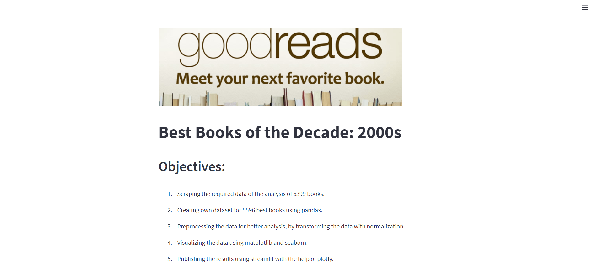

# GoodRead Scraper - Best Books of the Decade: 2000s

## Description

This is a analysis of best books of the Decade: 2000s. The data was collected using a webscraper which is implemented from scratch. The scraper extracts most of the information of the books which is analyzed and the findings were observed with matplotlib and seaborn.

## Usage

To use this repo,

- first run the requirement file to install the dependencies  
  `pip3 install -r requirements.txt`
- Next, run the streamlit app using  
  `streamlit run app.py`

- Check the final report <a href="report/DataAnalysis-Report.pdf" type="application/pdf" class="image fit">here</a>
